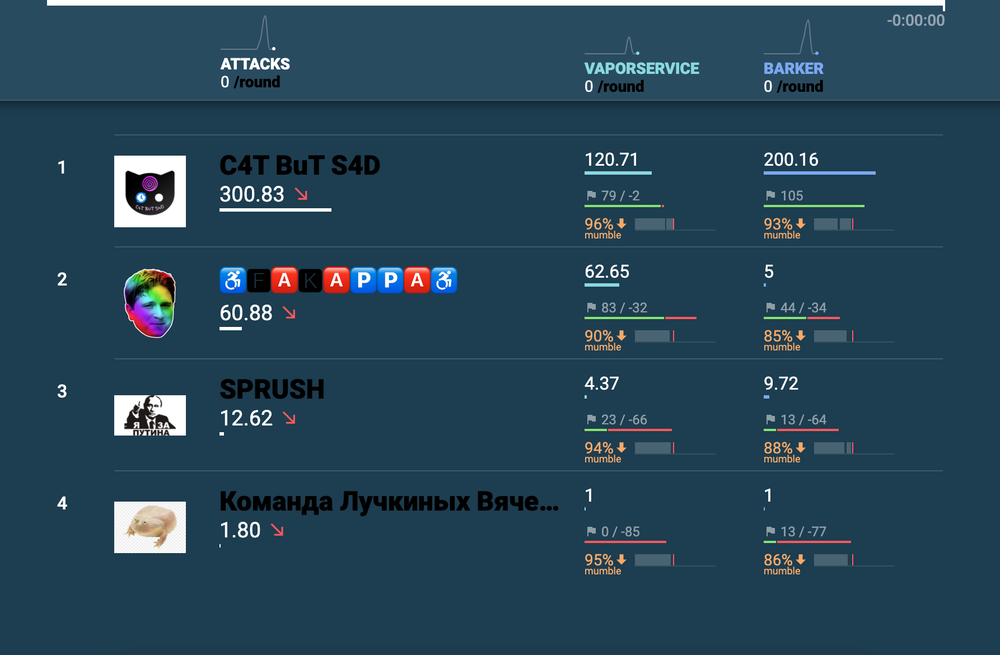

# CTF Cup 2020 (A/D Finals part)

The contest is driven by classic rules (Attack-Defense [CTF](https://en.wikipedia.org/wiki/Capture_the_flag#Computer_security)). Each team is given a set of vulnerable services. Organizers regulary fill services with private information — the flags. The goal of each team is to find vulnerabilities, fix them in their services and exploit them in order to get flags from other teams.  
  
### Team
Infrastucture admin: [@xelez](https://github.com/xelez)  
"Barker" service: [@kot](https://github.com/kot)  
"VaporService" service: [@capitanbanana](https://github.com/capitanbanana)  
Team lead: [@rx00](https://github.com/rx00)  
  
### Final scoreboard
  

CTF Cup 2020 (A/D Finals part) was held on December 12, 2020.  
Copyright (C) 2020 [HackerDom](http://hackerdom.ru)
